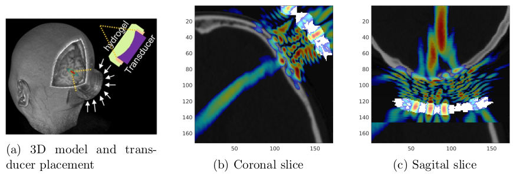
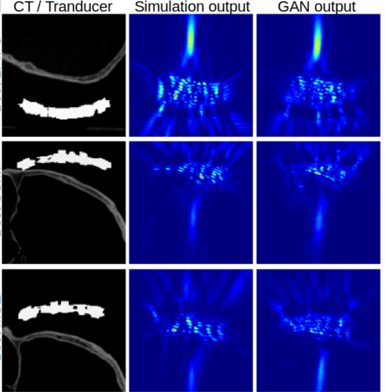

# FusGAN: GAN-Based Ultrasound Simulation from CT Slices

## Overview

This project utilizes Generative Adversarial Networks (GANs) to generate ultrasound simulations from CT slices and a transducer mask. By leveraging GANs, the system can produce realistic ultrasound intensity maps given a CT scan and a transducer mask input.



## Features

- **Ultrasound Simulation Generation**: Convert CT slices into simulated ultrasound images.
- **Mask Input**: Utilize masks to define the transducer placement and orientation guide the simulation process and focus on specific regions.
- **Customizable Settings**: Adjust parameters to fit different use cases and requirements.

## Installation

1. **Clone the Repository**:

    ```bash
    git clone https://github.com/aconesac/fusGAN.git
    cd fusGAN
    ```

2. **Install Dependencies**:

    It is recommended to use a virtual environment. Install the required Python packages with:

    ```bash
    pip install -r requirements.txt
    ```

    Make sure you have the necessary libraries for GANs and image processing, such as TensorFlow, NumPy, scikit-learn.

## Usage

1. **Prepare Your Data**:

    - Place your CT slices and corresponding mask images in the `data/ct_slices` and `data/tr_masks` directories, respectively. Place the output simulations for training in `data/pi_maps_`.

2. **Train the GAN**:

    ```bash
    python train_gan.py --ct_data_path=data/ct_slices --mask_data_path=data/masks --sim_path=data/pii
    ```

    This command trains the GAN model using your CT and mask data and saves the trained model in the `models/` directory.

3. **Generate Ultrasound Simulations**:

    ```bash
    python generateSimulation.py --ct_image_path=data/ct_slices/example_ct_slice.png --mask_path=data/masks/example_mask.png --model_path=models/trained_gan_model.h5 --output_path=results/
    ```

    This command generates an ultrasound simulation for a given CT slice and mask, saving the result in the `results/` directory.

## Examples

- **Example Input**: `data/ct_slices/example_ct_slice.png`, `data/masks/example_mask.png`, `data/pii/sim_out.png`
- **Example Output**: `results/simulated_ultrasound.png`



## Notes

- Ensure your input CT slices and masks are properly aligned and preprocessed for optimal results.
- The performance and quality of the generated ultrasound images depend on the quality and quantity of the training data.

## Contributing

If you'd like to contribute to this project, please fork the repository and submit a pull request with your changes. 

## License

This project is licensed under the MIT License - see the [LICENSE](LICENSE) file for details.

## Contact

For any questions or issues, please contact [Agustin Conesa](mailto:aconesa@researchmar.net).
